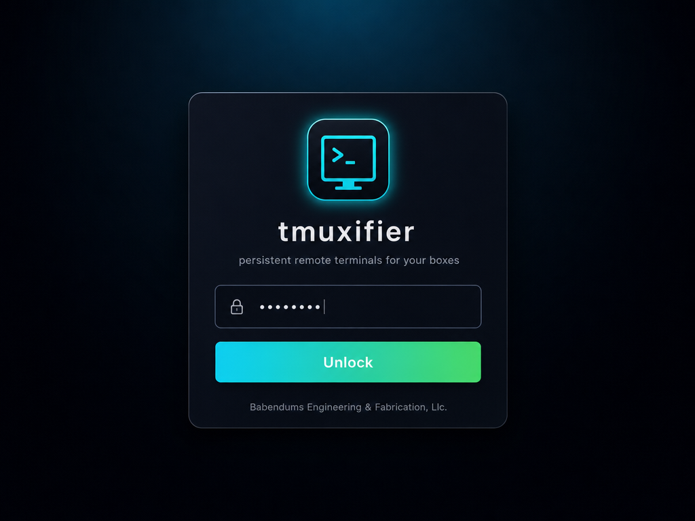
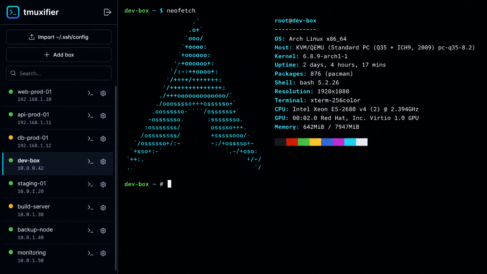
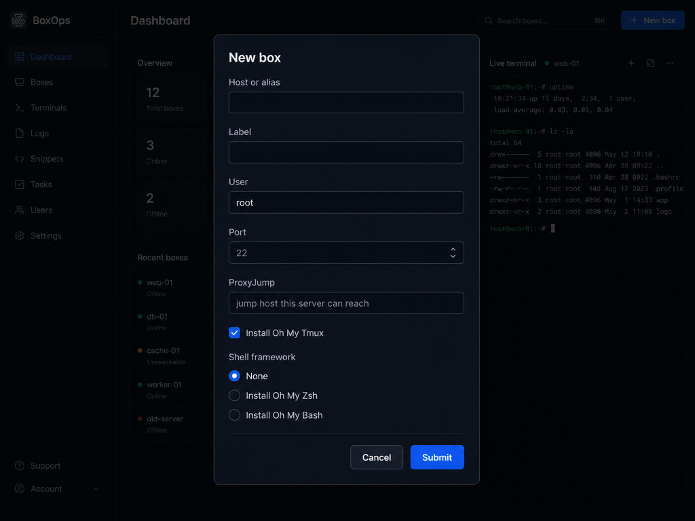

#  tmuxifier

[](LICENSE)

A single-user web dashboard for managing headless boxes over SSH. Each box opens a
browser terminal backed by a tmux session that lives **on the box**, so closing the tab,
losing the network, or restarting Tmuxifier leaves your work running — reconnecting drops you
back into the same state.

## Screenshots

| Login | Dashboard |
|:---:|:---:|
| [](docs/screenshots/login.png) | [](docs/screenshots/dashboard.png) |

| Add Box |
|:---:|
| [](docs/screenshots/add-box.png) |

## Requirements
- Node 20+
- The OpenSSH client, with your keys/agent/`~/.ssh/config` already working from the shell
- Tmuxifier installs `tmux` when a box is added if the remote user is root or has passwordless
  `sudo` for the system package manager

## Setup
```bash
npm install
npm run build
npm run set-password   # writes the password hash + cookie secret into ./.env
npm start
```
Open http://127.0.0.1:7437.

Configuration lives in a gitignored **`.env` file in the repo root**, so Tmuxifier is
self-contained — nothing needs to be set in your shell. `npm run set-password` creates (or
updates) `.env` with `TMUXIFIER_PASSWORD_HASH` and `TMUXIFIER_COOKIE_SECRET`; re-running it
changes the password while keeping the existing cookie secret (so you stay logged in). Copy
`.env.example` to `.env` first if you want to set other options up front.

## Configuration
All options are read from `.env` in the repo root (see `.env.example`). Each key can also be
set as a real shell environment variable, which **overrides** the file. Precedence, low to
high: built-in defaults → `config.json` → `.env` → shell environment.

| Key | Env / `.env` key | Default |
| --- | --- | --- |
| bind address | `TMUXIFIER_BIND` | `127.0.0.1` |
| port | `TMUXIFIER_PORT` | `7437` |
| grace seconds | `TMUXIFIER_GRACE` | `45` |
| host-key policy | `TMUXIFIER_HOSTKEY_POLICY` | `accept-new` |
| status probe concurrency | `TMUXIFIER_STATUS_CONCURRENCY` | `4` |
| status poll interval (ms) | `TMUXIFIER_STATUS_POLL_MS` | `30000` |
| SSH ControlPersist seconds | `TMUXIFIER_CONTROL_PERSIST` | `600` |
| terminal font family | `TMUXIFIER_TERM_FONT` | (bundled font) |
| terminal font size (px) | `TMUXIFIER_TERM_FONT_SIZE` | `12` |
| fleet command concurrency | `TMUXIFIER_FLEET_CONCURRENCY` | `4` |
| fleet per-box timeout (ms) | `TMUXIFIER_FLEET_TIMEOUT_MS` | `15000` |
| fleet job history kept | `TMUXIFIER_FLEET_MAX_JOBS` | `50` |
| fleet per-box output cap (bytes) | `TMUXIFIER_FLEET_MAX_OUTPUT_BYTES` | `65536` |
| health history samples/box | `TMUXIFIER_HEALTH_HISTORY_MAX` | `120` |
| health events retained | `TMUXIFIER_HEALTH_EVENTS_MAX` | `200` |
| health cpu/mem/disk warn % | `TMUXIFIER_HEALTH_{CPU,MEM,DISK}_WARN_PCT` | `90` |
| health threshold hysteresis % | `TMUXIFIER_HEALTH_HYSTERESIS_PCT` | `5` |
| Proxmox task poll interval (ms) | `TMUXIFIER_PVE_POLL_MS` | `1500` |
| Proxmox per-request timeout (ms) | `TMUXIFIER_PVE_TIMEOUT_MS` | `15000` |
| Proxmox provision timeout (ms) | `TMUXIFIER_PVE_PROVISION_TIMEOUT_MS` | `600000` |
| Proxmox DHCP-lease wait (ms) | `TMUXIFIER_PVE_LEASE_TIMEOUT_MS` | `60000` |
| Proxmox provision job history kept | `TMUXIFIER_PVE_MAX_JOBS` | `50` |
| Proxmox default management pubkey | `TMUXIFIER_PVE_DEFAULT_PUBKEY` | auto-detect `~/.ssh/*.pub` |
| auth mode | `TMUXIFIER_AUTH_MODE` | `password` |
| password hash | `TMUXIFIER_PASSWORD_HASH` | — (required) |
| cookie secret | `TMUXIFIER_COOKIE_SECRET` | — (required) |
| base external URL | `TMUXIFIER_BASE_EXTERNAL_URL` | (none) |
| OAuth client id | `TMUXIFIER_OAUTH_CLIENT_ID` | (none) |
| OAuth client secret | `TMUXIFIER_OAUTH_CLIENT_SECRET` | (none) |
| allowed Google emails | `TMUXIFIER_ALLOWED_EMAILS` | (none) |
| data dir | `TMUXIFIER_DATA_DIR` | `<repo>/data` |
| control-socket dir | `TMUXIFIER_CONTROL_DIR` | `<dataDir>/cm` |
| ssh config for Tmuxifier SSH calls | `TMUXIFIER_SSH_CONFIG` | (none) |
| TLS cert (PEM) | `TMUXIFIER_TLS_CERT` | (none → serves HTTP) |
| TLS key (PEM) | `TMUXIFIER_TLS_KEY` | (none → serves HTTP) |

Set **both** `TMUXIFIER_TLS_CERT` and `TMUXIFIER_TLS_KEY` to serve HTTPS directly; when TLS is active
the session cookie is automatically marked `Secure`. An `https://` `TMUXIFIER_BASE_EXTERNAL_URL`
also marks it `Secure` for deployments behind a TLS-terminating proxy or tunnel.

As an alternative to `.env`, a `config.json` in the repo root works too, using camelCase keys
(`passwordHash`, `cookieSecret`, `bindAddress`, `port`, `graceSeconds`, `hostKeyPolicy`,
`statusConcurrency`, `statusPollMs`, `controlPersist`, `termFont`, `termFontSize`, `fleetConcurrency`, `fleetTimeoutMs`,
`fleetMaxJobs`, `fleetMaxOutputBytes`, `healthHistoryMax`, `healthEventsMax`, `healthCpuWarnPct`,
`healthMemWarnPct`, `healthDiskWarnPct`, `healthThresholdHysteresisPct`, `pvePollMs`, `pveTimeoutMs`, `pveProvisionTimeoutMs`,
`pveLeaseTimeoutMs`, `pveMaxJobs`, `pveDefaultPubKeyPath`, `authMode`, `publicUrl`, `googleClientId`,
`googleClientSecret`, `allowedEmails`, `dataDir`, `controlDir`, `sshConfigFile`, `tlsCert`,
`tlsKey`). The UI also persists `localShell` in `config.json`; it does not have an env key.
`TMUXIFIER_SSH_CONFIG`/`sshConfigFile` is passed to `ssh` as `-F`, so it is an alternate config
file for Tmuxifier's SSH commands, not an extra file merged with `~/.ssh/config`.

`TMUXIFIER_TERM_FONT` sets the font for the browser **terminal sessions** (not the dashboard
chrome). It is a single family name, prepended to the bundled font stack, so it must be installed
on the device viewing the dashboard — otherwise that device transparently falls back to the bundled
**MesloLGMDZ Nerd Font** (Line Gap Medium, dotted zero, the default terminal font). An unsafe or
empty value is ignored. The bundled fonts (MesloLGMDZ, then MesloLGSDZ and JuliaMono) always remain
as the fallback, so symbol glyphs (e.g. Claude Code's UI) keep rendering regardless of the choice.

The sidebar's **export** (⤓) and **import** (⤒) buttons download and upload the full box list as a
JSON file — a portable backup you can move between Tmuxifier instances. Import adds boxes from the
file, re-minting each id and skipping any whose host/label already exists (so re-importing is safe).
It carries no SSH secrets; boxes still rely on your keys/agent/`~/.ssh/config` at connect time.

## Authentication
`TMUXIFIER_AUTH_MODE` selects one login method. The default is `password`; set it to
`oauth` to replace the password form with Google sign-in. The modes are exclusive.

Password mode:
```bash
npm run set-password
```
This writes `TMUXIFIER_PASSWORD_HASH` and, if absent, `TMUXIFIER_COOKIE_SECRET` to `.env`.

OAuth mode:
```bash
npm run gen-secret
```
Then set these `.env` keys:
```ini
TMUXIFIER_AUTH_MODE=oauth
TMUXIFIER_BASE_EXTERNAL_URL=tmuxifier.example.com
TMUXIFIER_OAUTH_CLIENT_ID=...
TMUXIFIER_OAUTH_CLIENT_SECRET=...
TMUXIFIER_ALLOWED_EMAILS=you@example.com,teammate@example.com
```
Tmuxifier treats a scheme-less public URL as HTTPS. In Google Cloud Console, create an OAuth
client ID for a web application and register this
authorized redirect URI:
```text
https://tmuxifier.example.com/api/auth/google/callback
```
The allowlist is exact email addresses only, matched case-insensitively. Domain wildcards are
not supported. The older `TMUXIFIER_PUBLIC_URL`, `TMUXIFIER_GOOGLE_CLIENT_ID`,
`TMUXIFIER_GOOGLE_CLIENT_SECRET`, and `TMUXIFIER_AUTH_MODE=google` names are still accepted.

## How persistence works
Each terminal runs `ssh -tt <box> "tmux new-session -A -D -s <session>"` (the `-D` detaches any
other client so a stale connection can't freeze the layout). `<session>` is the box's tmux session
name — set per box in the Add/Edit dialog (a type-or-pick field whose ⟳ button fetches the host's
live sessions), defaulting to `web`. Because tmux runs on the box, the session and its processes
survive disconnects. A 45s server-side grace window makes brief reconnects seamless; after that
the local ssh process is dropped while the on-box session keeps running.

When a box is added, Tmuxifier persists the box immediately and opens a live provisioning
panel. That provisioning flow checks for `tmux`, installs it through a known package manager
when possible (`apt-get`, `dnf`, `yum`, `pacman`, `apk`, or `zypper`), applies any selected
shell/theme options, and creates the configured tmux session. If provisioning exits non-zero,
the new box is rolled back from the list. Removing a box closes any local terminal process for
that box and best-effort kills the configured remote tmux session before deleting the box.

## Status, multiplexing & rate-limit safety
Tmuxifier talks to each box over SSH continuously — a background **status probe** keeps the
sidebar dots current, and each open terminal is another SSH connection. Left naive, that churn
(a fresh handshake, plus a failed auth on password boxes, every few seconds) is exactly what
trips a box's brute-force protection — `fail2ban`, `sshguard`, or a connection-rate firewall
rule — and gets the Tmuxifier host's IP **banned**, which then makes the box look dead. Several
mechanisms keep the connection rate low and reuse one warm connection:

- **One shared poll, not one per tab.** Status is probed by a single **server-side** loop (every
  `TMUXIFIER_STATUS_POLL_MS`, default 30s); every open dashboard tab reads the same cached snapshot
  instead of driving its own probe cycle, so the SSH connection rate does **not** multiply with the
  number of tabs you leave open. Concurrent probes of the same box are also coalesced into one
  connection. (Before this, several open tabs could fan out enough simultaneous handshakes to arm a
  box's rate limiter.)
- **Connection multiplexing (keep one warm).** Every probe and terminal for a box shares a
  single persistent SSH **ControlMaster** socket under `data/cm/`, authenticated once and kept
  alive for `TMUXIFIER_CONTROL_PERSIST` seconds (default 600) after its last use. Repeated
  status checks and reconnects ride that one connection instead of re-authenticating — no
  per-probe handshake, no per-probe auth attempt.
- **Adaptive status backoff.** Probing starts at the ~30s poll cadence, but each consecutive
  failure *escalates* the interval (30s → 60s → … up to a **5-minute floor**), and a box that
  needs a password jumps straight to the 5-minute floor — fast probing there can never succeed
  and only feeds `fail2ban`. It never fully stops, so a box that recovers turns green on its own
  within ≤5 minutes. A successful check, or opening/reconnecting the box, resets it to the fast
  cadence.
- **Don't probe a box you're using.** While a terminal session is open for a box, the status
  probe is skipped entirely — the dot is read from the live ControlMaster instead (master up ⇒
  connected; absent ⇒ needs auth) — so a probe can't collide with your interactive login on the
  shared socket.
- **Fail fast, then back off.** Both probes and interactive connects set an SSH `ConnectTimeout`
  (≈6s / 10s) so an unreachable box fails quickly instead of hanging. The browser terminal then
  reconnects on its own escalating backoff to a **5-minute floor** — a box left open while it's
  down settles to roughly one attempt every five minutes (gentle enough not to arm a limiter)
  and auto-reconnects within ≤5 minutes of coming back. A connection that proves stable resets
  the backoff to fast.
- **Bounded fan-out.** A full status sweep probes boxes in small batches
  (`TMUXIFIER_STATUS_CONCURRENCY`, default 4), so the dashboard never opens a fleet-wide burst of
  simultaneous handshakes.

If a box still bans the Tmuxifier host (a red dot that pings but times out on port 22), the bans
are time-limited — the low, backed-off connection rate lets them expire instead of continually
re-arming them. To clear one immediately, unban the Tmuxifier host's IP on that box
(e.g. `fail2ban-client unbanip <ip>`) and consider allowlisting it (`ignoreip`).

### Box health history & events

The dashboard keeps a rolling per-box health trend from the samples the 30-second status poll
already collects — **no extra SSH**. Each box row shows a small sparkline of the last ~hour
(click it to cycle CPU → memory → disk), and the sidebar's **Events** button opens an in-app
timeline of transitions: box went down / recovered / needs login, plus CPU/mem/disk crossing a
warn threshold (default 90%, with hysteresis so a hovering value doesn't flap). Unseen events
show as a count badge on the button and are marked seen when the panel is opened. Events survive
restarts in `data/health-events.json`; the sample series is in-memory only. Everything is
**display-only** — Tmuxifier sends no browser, email, or webhook notifications (a possible future
phase). Tune with `TMUXIFIER_HEALTH_HISTORY_MAX`, `TMUXIFIER_HEALTH_EVENTS_MAX`,
`TMUXIFIER_HEALTH_{CPU,MEM,DISK}_WARN_PCT`, and `TMUXIFIER_HEALTH_HYSTERESIS_PCT`.

### Fleet Command

Click **Fleet** in the sidebar to enter selection mode, tick any number of boxes (or whole tag
groups), type a command, and **Run**. The command runs once on each selected box over the same
non-interactive SSH path used for status probes, and each box's exit code and output are captured
centrally. Each run is a **job** held on the server: close the tab and the run keeps going —
reopen the dashboard and the **Jobs** button lists recent jobs with their per-box results. Jobs
are persisted to `data/fleet-jobs.json` (last `TMUXIFIER_FLEET_MAX_JOBS`, default 50). The fan-out
is capped at `TMUXIFIER_FLEET_CONCURRENCY` (default 4) so a fleet-wide run never bursts SSH
connections. Password-only boxes with no live connection come back as a per-box error (the
non-interactive path can't answer a password prompt) — open that box's terminal once to establish
the connection, then re-run.

## Proxmox LXC provisioning

Tmuxifier can provision a "canned" LXC container on a Proxmox VE host over the PVE HTTP API and
auto-add a box pointed at it, so a freshly created container opens straight into a browser terminal.

**1. Create an API token in Proxmox.** *Datacenter → Permissions → API Tokens → Add*. Pick a
user/realm (e.g. `user@pam`), a token id (e.g. `tmuxifier`), and copy the secret (shown once).
**Grant the token its own permissions** — tokens default to "Privilege Separation", so the token has
no rights even when the user does. In a lab, add the token (*Datacenter → Permissions → Add → API
Token Permission*, path `/`, propagate) the built-in **`PVEVMAdmin`** role (container create/start
plus `Datastore.AllocateSpace`/`Datastore.Audit`) **and `PVEAuditor`** (the `Sys.Audit` that lets
the node/storage/bridge dropdowns populate). Use a privilege-separated token, not full
`Administrator`.

**2. Add the host.** Dashboard → **Proxmox → Hosts → Add**: enter the endpoint (`host:8006`), the
token id (`user@pam!tmuxifier`) and the secret. Click **Inspect** to fetch and **pin** the host's
TLS certificate (Proxmox ships a self-signed cert; pinning is trust-on-first-use, like
`ssh accept-new`). Save — Tmuxifier verifies the token before storing it.

**3. Review LXC Secrets.** **Proxmox → LXC Secrets**. Tmuxifier's own host key is auto-detected and
shown as the **default management key** — injected into every container so Tmuxifier can SSH in (set
`TMUXIFIER_PVE_DEFAULT_PUBKEY` if your key isn't at `~/.ssh/id_*`). Optionally add more **public
keys** (e.g. your laptop's) and/or an **optional root password**. Added keys and the password are
encrypted at rest and shown masked after saving; the private half of any key stays in your own SSH
setup — Tmuxifier never stores private keys.

**4. Define a preset and provision.** **Presets → Add** a blueprint (template, CPU/mem/disk,
storage, network). Then **Provision → pick a preset → enter a hostname** (optionally a tag and
oh-my-tmux/zsh/bash). Watch the live task log; once the container is up Tmuxifier installs tmux (and
any selected frameworks) over SSH, then an **Open terminal** button drops you into it.

**Security.** The API token, any added SSH keys, and the optional root password are **encrypted at
rest** (AES-256-GCM; key derived from your cookie secret) in the gitignored `data/proxmox.json`
(`0600`), and are never sent to the browser. TLS is pinned for self-signed certs and CA-verified
when the host presents a valid certificate. If you rotate `TMUXIFIER_COOKIE_SECRET`, previously-saved
secrets become undecryptable — re-add each Proxmox host (and re-enter keys/password) afterward.

## Security
Tmuxifier can SSH into your whole fleet, so the login gate is the crown jewel. It binds to
`127.0.0.1` by default. To expose it on a network, **always use TLS** — either set
`TMUXIFIER_TLS_CERT`/`TMUXIFIER_TLS_KEY` to serve HTTPS directly (a self-signed cert works; browsers
show a one-time warning), or front it with a TLS reverse proxy — and set `TMUXIFIER_BIND`
accordingly. Serving the login over plain HTTP on a non-loopback address sends credentials
in cleartext. Passwords are scrypt-hashed; OAuth mode uses an exact-email allowlist; the
session cookie is signed, httpOnly, SameSite=lax, and marked `Secure` for local TLS or an
`https://` base external URL. Tmuxifier stores no SSH secrets — your keys and agent stay in the OS.

Generate a self-signed cert (valid for an IP) with:
```bash
openssl req -x509 -newkey rsa:2048 -nodes -days 825 \
  -keyout key.pem -out cert.pem -subj "/CN=tmuxifier" \
  -addext "subjectAltName=IP:192.168.1.10,IP:127.0.0.1,DNS:localhost"
```

## Deployment
Run Tmuxifier as a long-lived **systemd** service. A deployment is just a checkout of the repo
plus a small unit that runs `node src/server/index.js` from it — config (`.env`), certs
(`tls/`), and state (`data/`) all stay inside the repo folder.

The repo ships a ready-to-use unit at [deploy/tmuxifier.service](deploy/tmuxifier.service),
which assumes the repo is at `/root/tmuxifier` running as `root`:

```ini
[Unit]
Description=Tmuxifier - web dashboard for managing SSH/tmux boxes
After=network-online.target
Wants=network-online.target

[Service]
Type=simple
User=root
WorkingDirectory=/root/tmuxifier
# HOME must be set so the ssh children find ~/.ssh (keys, config, known_hosts)
Environment=HOME=/root
ExecStart=/usr/bin/node /root/tmuxifier/src/server/index.js
Restart=on-failure
RestartSec=2
NoNewPrivileges=true

[Install]
WantedBy=multi-user.target
```

Install and start it (after `npm install && npm run build && npm run set-password`):

```bash
sudo cp deploy/tmuxifier.service /etc/systemd/system/tmuxifier.service
# Not running from /root/tmuxifier as root? Edit User=, WorkingDirectory=,
# Environment=HOME=, and the node path in ExecStart= to match your install.
sudo systemctl daemon-reload
sudo systemctl enable --now tmuxifier   # start now + on boot
systemctl status tmuxifier              # confirm it is active
```

Two things to know: the app reads `.env` itself, so secrets are deliberately **not** placed in
the unit (it holds no credentials); and `HOME` is set in the unit — not `.env` — so the `ssh`
child processes can find `~/.ssh`. To update a running deployment: `git pull`, `npm install`
(only if dependencies changed), `npm run build`, then `sudo systemctl restart tmuxifier`.

See [docs/DEPLOY.md](docs/DEPLOY.md) for the full guide — passwordless SSH key setup, TLS certs,
Google OAuth behind a Cloudflare tunnel, the file-layout table, and password rotation.

## Attributions

Tmuxifier can optionally install and configure these excellent projects on your boxes during
provisioning:

| Project | Repository | What it does |
| --- | --- | --- |
| **Oh My Zsh** | [ohmyzsh/ohmyzsh](https://github.com/ohmyzsh/ohmyzsh) | Zsh framework with plugins, themes, and helpers |
| **Oh My Bash** | [ohmybash/oh-my-bash](https://github.com/ohmybash/oh-my-bash) | Bash framework with themes and completions |
| **Oh My Tmux** | [gpakosz/.tmux](https://github.com/gpakosz/.tmux) | Tmux configuration by Gregory Pakosz |

Each installs via its upstream bootstrap script and is skipped if already present on the box.

## Development
```bash
npm run dev    # vite + node --watch, proxying /api and /term to the backend
npm test       # unit + integration (Vitest)
npm run test:e2e
```
