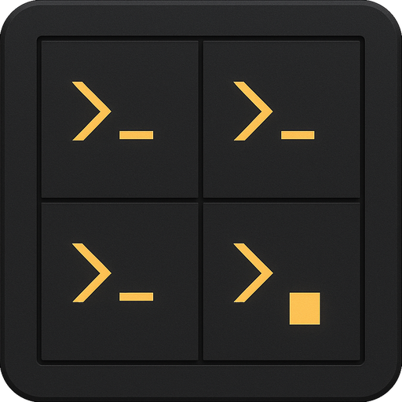
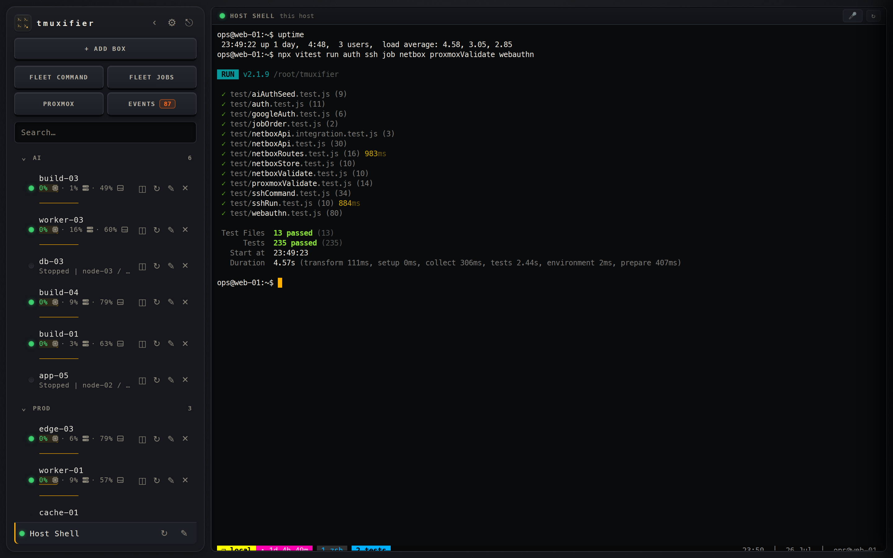
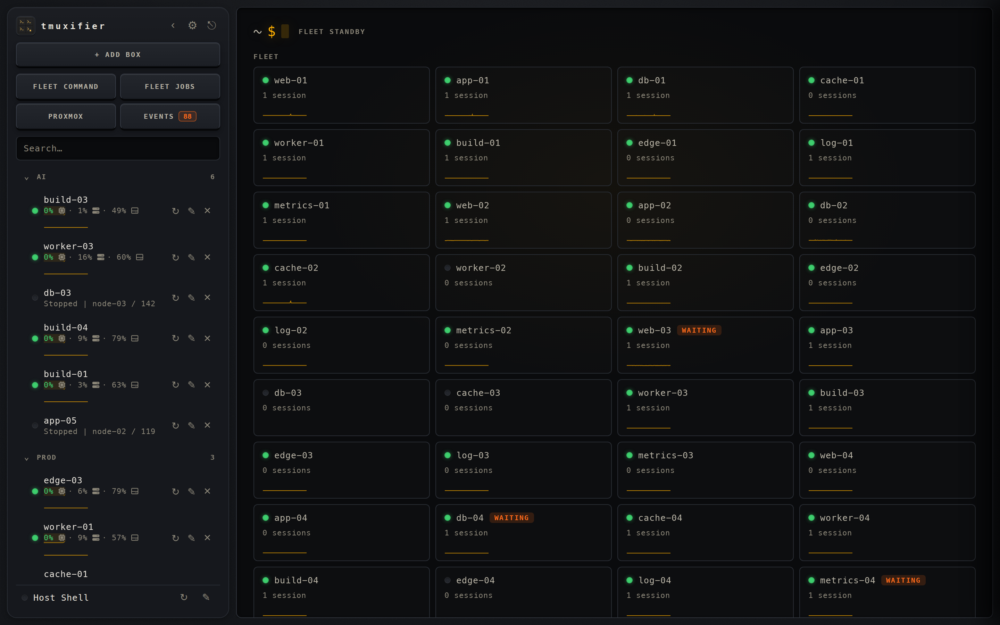
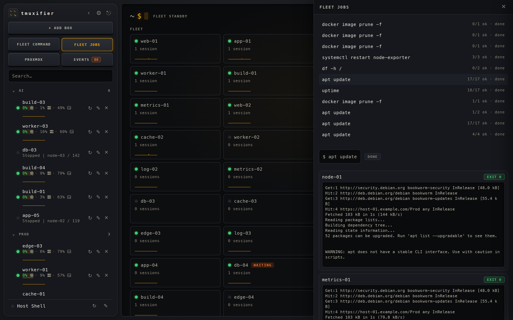
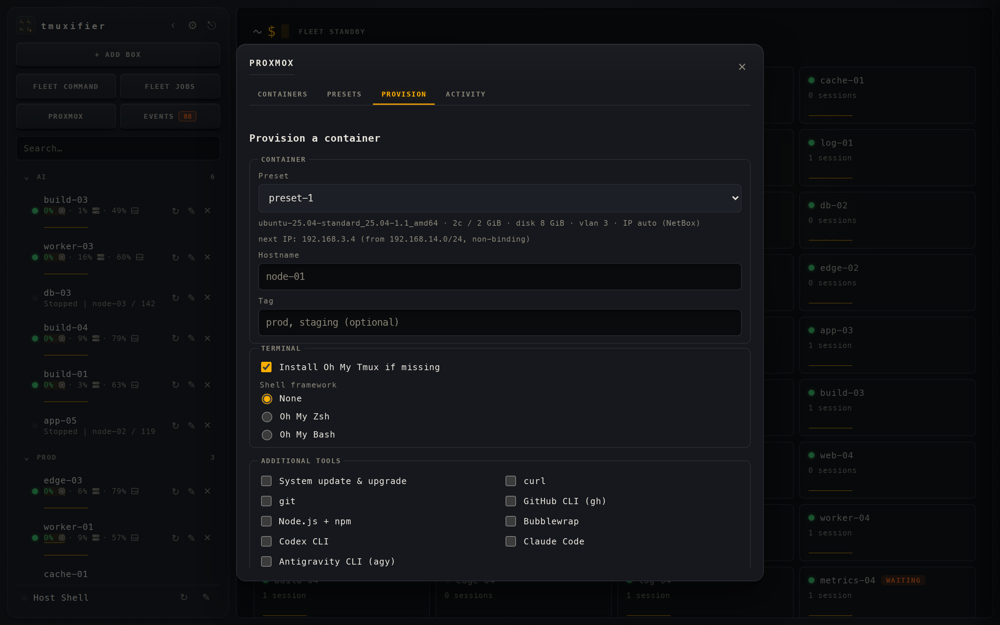
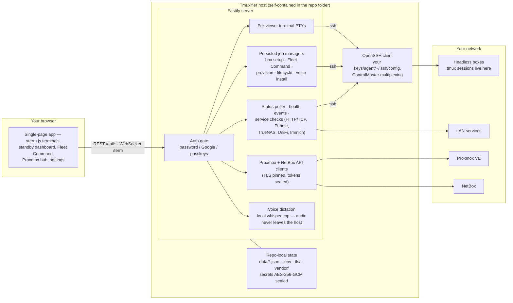

#  tmuxifier

[](LICENSE)

A single-user web dashboard for managing headless boxes over SSH. Each box opens a
browser terminal backed by a tmux session that lives **on the box**, so closing the tab,
losing the network, or restarting Tmuxifier leaves your work running — reconnecting drops you
back into the same state.

## Contents

- [Screenshots](#screenshots)
- [Requirements](#requirements)
- [Setup](#setup)
- [Configuration](#configuration)
- [Authentication](#authentication)
- [Architecture](#architecture)
- [Documentation](#documentation)
- [How persistence works](#how-persistence-works)
- [Standby dashboard](#standby-dashboard)
- [Terminal features](#terminal-features)
- [Themes](#themes)
- [Android app (agent console)](#android-app-agent-console)
- [Status, health & Fleet Command](#status-health--fleet-command)
- [Proxmox](#proxmox)
- [Security](#security)
- [Deployment](#deployment)
- [Attributions](#attributions)
- [Development](#development)

## Screenshots

| Persistent remote terminals | Fleet standby dashboard |
|:---:|:---:|
| [](docs/screenshots/terminal-v1.19.png) | [](docs/screenshots/dashboard-v1.19.png) |
| The tmux session runs on the box, not in the browser — close the tab or lose the network and the work carries on. Reconnecting reattaches it. | The standby dashboard fills the stage whenever no terminal is docked — click any box to reattach to its on-box tmux session. |

| Fleet Command | Proxmox LXC provisioning |
|:---:|:---:|
| [](docs/screenshots/fleet-command-v1.19.png) | [](docs/screenshots/proxmox-provision-v1.19.png) |
| Select boxes by group, run a command or bash script with bounded concurrency, and inspect each result. | Provision from reusable presets, inject management keys, discover the container, and link it back as a Tmuxifier box. |

## Requirements
- Node 20+
- The OpenSSH client, with your keys/agent/`~/.ssh/config` already working from the shell
- Tmuxifier installs `tmux` when a box is added if the remote user is root or has passwordless
  `sudo` for the system package manager

## Setup
```bash
npm install
npm run build
npm run set-password   # writes the password hash + cookie secret into ./.env
npm start
```
Open http://127.0.0.1:7437.

Configuration lives in a gitignored **`.env` file in the repo root**, so Tmuxifier is
self-contained — nothing needs to be set in your shell. `npm run set-password` creates (or
updates) `.env` with `TMUXIFIER_PASSWORD_HASH` and `TMUXIFIER_COOKIE_SECRET`; re-running it
changes the password while keeping the existing cookie secret (so you stay logged in). Copy
`.env.example` to `.env` first if you want to set other options up front.

## Configuration
All options are read from `.env` in the repo root (see `.env.example`); each key can also be
set as a real shell environment variable, which **overrides** the file. A `config.json` with
camelCase keys works too. Precedence, low to high: built-in defaults → `config.json` → `.env`
→ shell environment.

The essentials:

| Setting | Key | Default |
| --- | --- | --- |
| bind address | `TMUXIFIER_BIND` | `127.0.0.1` |
| port | `TMUXIFIER_PORT` | `7437` |
| auth mode | `TMUXIFIER_AUTH_MODE` | `password` |
| password hash | `TMUXIFIER_PASSWORD_HASH` | — (written by `npm run set-password`) |
| cookie secret | `TMUXIFIER_COOKIE_SECRET` | — (written by `npm run set-password`) |
| TLS cert / key (PEM paths) | `TMUXIFIER_TLS_CERT` / `TMUXIFIER_TLS_KEY` | (none → serves HTTP) |
| base external URL | `TMUXIFIER_BASE_EXTERNAL_URL` | (none) |
| trust reverse-proxy X-Forwarded-For | `TMUXIFIER_TRUST_PROXY` | off |

Set **both** TLS keys to serve HTTPS directly; the session cookie is then marked `Secure` (an
`https://` base external URL does the same behind a TLS-terminating proxy or tunnel). Behind a
reverse proxy, also set `TMUXIFIER_TRUST_PROXY` so login rate limiting sees each client's real
IP — and leave it unset when clients connect directly, since trusting forwarded headers from a
non-proxy lets them spoof their IP.

Every other option — status, fleet, and health tuning, terminal fonts, upload and voice limits,
the full `config.json` key list, and a tour of the ⚙ settings modal — is in the
[configuration reference](docs/configuration.md).

## Authentication
`TMUXIFIER_AUTH_MODE` selects the primary login method: `password` (default, set up by
`npm run set-password`) or `oauth`, which replaces the password form with Google sign-in
against an exact-email allowlist. A **passkey** is a separate, additive third way in, available
under either mode: enroll one from **Settings → Passkeys** while signed in, and optionally arm
**Require a passkey** to disable password/Google sign-in entirely — guarded against lockouts,
with `TMUXIFIER_PASSKEY_ONLY=off` in `.env` as the break-glass. OAuth setup, the
relying-party-id rules passkeys live by, and the passkey security model are covered in the
[authentication guide](docs/authentication.md).

## Architecture

One Node process serves everything: a Fastify server hosts the REST API, the `/term`
WebSocket, and the static web bundle. The browser side is a single-page TypeScript app;
each terminal is an xterm.js pane fed by its own per-viewer PTY on the server, which
shells out to **your** OpenSSH client — Tmuxifier stores no SSH secrets — and attaches a
tmux session that lives on the box.


```mermaid
flowchart LR
  subgraph browser["Your browser"]
    SPA["Single-page app — xterm.js terminals,<br/>standby dashboard, Fleet Command,<br/>Proxmox hub, settings"]
  end

  subgraph host["Tmuxifier host (self-contained in the repo folder)"]
    subgraph fastify["Fastify server"]
      AUTH["Auth gate<br/>password / Google / passkeys"]
      TERM["Per-viewer terminal PTYs"]
      JOBS["Persisted job managers<br/>box setup · Fleet Command ·<br/>provision · lifecycle · voice install"]
      POLL["Status poller · health events ·<br/>service checks (HTTP/TCP, Pi-hole,<br/>TrueNAS, UniFi, Immich)"]
      PROX["Proxmox + NetBox API clients<br/>(TLS pinned, tokens sealed)"]
      VOICE["Voice dictation<br/>local whisper.cpp — audio<br/>never leaves the host"]
    end
    SSHC["OpenSSH client<br/>your keys/agent/~/.ssh/config,<br/>ControlMaster multiplexing"]
    DATA["Repo-local state<br/>data/*.json · .env · tls/ · vendor/<br/>secrets AES-256-GCM sealed"]
  end

  subgraph net["Your network"]
    BOX["Headless boxes<br/>tmux sessions live here"]
    PVE["Proxmox VE"]
    NBX["NetBox"]
    LAN["LAN services"]
  end

  SPA -->|"REST /api/* · WebSocket /term"| AUTH
  AUTH --> TERM & JOBS & POLL & PROX & VOICE
  TERM & JOBS & POLL -->|"ssh"| SSHC
  SSHC --> BOX
  PROX --> PVE & NBX
  POLL --> LAN
  fastify --- DATA
```

Long-running work — box setup, Fleet Command runs, Proxmox provisioning and lifecycle,
the voice install — runs as persisted server-side jobs, so it survives the tab (and the
network) that started it. Status probes and service checks likewise run on a server-side
interval and serve a cached snapshot, so SSH and API traffic stays flat no matter how many
dashboard tabs are open. The full per-module map lives in [AGENTS.md](AGENTS.md).

## Documentation

| Guide | Covers |
| --- | --- |
| [Configuration reference](docs/configuration.md) | every option, `config.json`, terminal fonts, the settings modal |
| [Authentication](docs/authentication.md) | password & OAuth modes, passkeys, require-a-passkey |
| [Boxes & setup jobs](docs/boxes-and-setup.md) | setup jobs, tools checklist, statusline push, AI CLI auth seeding, post-setup script |
| [Terminal features](docs/terminal.md) | splits, uploads & clipboard, voice dictation, host shell, reconnect |
| [Standby dashboard](docs/dashboard.md) | service tiles, icons, Pi-hole/TrueNAS/UniFi/Immich cards |
| [Status, health & Fleet Command](docs/fleet-and-health.md) | rate-limit-safe probing, health events, fleet jobs, themes |
| [Proxmox](docs/proxmox.md) | LXC provisioning, guest lifecycle, deprovision |
| [Deployment](docs/DEPLOY.md) | systemd, passwordless SSH keys, TLS, OAuth behind a tunnel |

## How persistence works
Each terminal runs `ssh -tt <box> "tmux -u new-session -A -s <session>"`, so the session
and its processes live on the box and survive disconnects. A 45s server-side grace window makes
brief reconnects seamless; after that the local ssh process is dropped while the on-box session
keeps running.

Adding a box starts a **server-side setup job** that installs tmux where possible, applies any
selected shell frameworks and tools, and creates the tmux session — closing the tab doesn't
interrupt it, and a failed setup keeps the box and offers **Retry** (or **Finish
interactively** when a password prompt is the blocker). The same setup can push this host's
Claude Code statusline and **seed the box with this host's Claude/Codex subscription
credentials** — a deliberate, unchecked-by-default handover of your CLI identity to that box.
A saved Fleet Command script can also be selected to run as the last step of setup — after the
tools and credentials, before the tmux session. The setup-job lifecycle, the tools checklist,
and the seeding security model are in [boxes & setup jobs](docs/boxes-and-setup.md).

## Standby dashboard
When no terminal is docked, the stage shows a standby dashboard: **service tiles** for your
homelab's web services (with automatically resolved logos and server-side liveness checks), a
**fleet overview** card per box, and an **infrastructure readout** of Proxmox node health and
NetBox IPAM utilization. Four credentialed tile kinds go beyond up/down: **Pi-hole**,
**TrueNAS**, **UniFi**, and **Immich** render live stat cards from their APIs — all read-only,
with each secret AES-256-GCM encrypted at rest. Per-integration setup walkthroughs are in the
[dashboard guide](docs/dashboard.md).

## Terminal features
Up to four terminals share the stage in nested, resizable splits. Pasting an image or dropping
a file onto a terminal uploads it to the box over the existing SSH connection and types the
quoted path at a Claude Code or shell prompt (never into a busy pane); selections and in-app
OSC 52 copies land on your clipboard. **Voice dictation** (Ctrl+Shift+Space) records in your
browser and transcribes on the Tmuxifier host with local whisper.cpp — audio never leaves the
host. A **Host Shell** opens a terminal on the Tmuxifier host itself, and every box row has a
**Reconnect** action, plus a confirm-gated **Forget host key** for a box you rebuilt. Details
in [terminal features](docs/terminal.md).

## Themes
**Settings → Appearance** re-skins the whole app — chrome, standby dashboard, terminal glass and
the Fleet script editor — switching between the built-in **Bench Instrument** (charcoal chassis,
amber phosphor) and **Original** (deep navy, cyan glow) looks, saved on the Tmuxifier host so
every browser you sign in from follows the same pick; details, and how to add a theme, are in
[appearance & themes](docs/fleet-and-health.md#appearance).

## Android app (agent console)
A native Kotlin/Compose companion in [`android/`](android/) for driving **Claude Code
sessions from a phone**: fleet glance with waiting-first sorting, a read-only pane snapshot
rendered as native text (tmux stays the terminal emulator — phone viewing can never resize
your desktop windows), a semantic action row, a local-until-send composer, and FCM push when
an agent needs you. Devices enroll with a single-use **pairing code** minted in Settings →
Devices, where the signed APK is also downloadable once one has been published on your server.

Two ways to get the app. Join the **[internal testing
track](https://play.google.com/apps/internaltest/4701129402312577506)** for a Play-signed build
that auto-updates — it carries nothing project-specific, so it works against *your* server once
you pair it. Or build one on the server (Settings → Devices → **Build app**, which needs the
Android SDK on the host) and install it from that download link. Either way the app talks only
to the Tmuxifier you pair it with. Details in [the Android app guide](docs/android-app.md).

## Status, health & Fleet Command
A single server-side loop probes every box over a shared SSH ControlMaster with adaptive
backoff and bounded fan-out, so status traffic stays low enough never to trip a box's
`fail2ban`-style brute-force protection — no matter how many dashboard tabs are open. The same
samples feed per-box health sparklines and an event timeline (down/up transitions, resource
thresholds, and **Claude Code waiting/finished** agent events, with optional browser
notifications). **Fleet Command** runs a command or saved script across any selection of boxes
as a persisted server-side job with per-box results. The full rate-limit-safety design is in
[status, health & Fleet Command](docs/fleet-and-health.md).

## Proxmox
With a Proxmox VE host configured (API token over pinned TLS; secrets encrypted at rest),
Tmuxifier can **provision LXC containers** from reusable presets — DHCP, static, or
NetBox-allocated `auto-static` addressing — and auto-link the new container as a box. Any box
can also be linked by hand to an existing guest, container **or QEMU VM**, unlocking lifecycle
control: Start / Shutdown / Stop / Reboot and a confirm-gated **Deprovision** that destroys the
guest and releases its NetBox IP. Token permissions, presets, the shell-framework update
clamps, and the lifecycle rules are in [the Proxmox guide](docs/proxmox.md).

## Security
Tmuxifier can SSH into your whole fleet, so the login gate is the crown jewel. It binds to
`127.0.0.1` by default. To expose it on a network, **always use TLS** — either set
`TMUXIFIER_TLS_CERT`/`TMUXIFIER_TLS_KEY` to serve HTTPS directly (a self-signed cert works; browsers
show a one-time warning), or front it with a TLS reverse proxy — and set `TMUXIFIER_BIND`
accordingly. Serving the login over plain HTTP on a non-loopback address sends credentials
in cleartext. Passwords are scrypt-hashed and login attempts are rate-limited per IP (set
`TMUXIFIER_TRUST_PROXY` behind a proxy so the limiter sees real client IPs); OAuth mode uses an
exact-email allowlist; the session cookie is signed, httpOnly, SameSite=lax, expires after 7 days
(server-enforced), and is marked `Secure` for local TLS or an `https://` base external URL.

Tmuxifier stores no SSH secrets — your keys and agent stay in the OS. The credentials it does
persist — the Proxmox API token, any added SSH management keys, the optional Proxmox root
password, the NetBox API token, and each credentialed service tile's secret (a Pi-hole app
password or a TrueNAS/UniFi/Immich API key) — are all AES-256-GCM encrypted at rest
(`data/proxmox.json`, `data/netbox.json`, `data/services.json`, all `0600`) and never sent to
the browser.

A passkey (see [authentication](docs/authentication.md)) is phishing-resistant — it only works
on the exact hostname it was enrolled against — and its sign-in path shares the same per-IP rate
limiter as password login, so it's an added way in without being an added way around the
lockout. Enrolled passkeys are public keys, not secrets, so `data/passkeys.json` is **not**
encrypted like the files above; it is still written `0600`. A self-signed cert good for an IP
address takes one `openssl` command — see
[docs/DEPLOY.md](docs/DEPLOY.md#tls-recommended-whenever-you-bind-off-loopback).

## Deployment
Run Tmuxifier as a long-lived **systemd** service. A deployment is just a checkout of the repo
plus the sample unit at [deploy/tmuxifier.service](deploy/tmuxifier.service) — config (`.env`),
certs (`tls/`), and state (`data/`) all stay inside the repo folder, so `git pull` never touches
your secrets. The full guide — the unit walkthrough, passwordless SSH key setup for the service
user, TLS certs, Google OAuth behind a Cloudflare tunnel, the file-layout table, and password
rotation — is [docs/DEPLOY.md](docs/DEPLOY.md).

## Attributions

Tmuxifier can optionally install and configure these excellent projects on your boxes during
provisioning:

| Project | Repository | What it does |
| --- | --- | --- |
| **Oh My Zsh** | [ohmyzsh/ohmyzsh](https://github.com/ohmyzsh/ohmyzsh) | Zsh framework with plugins, themes, and helpers |
| **Oh My Bash** | [ohmybash/oh-my-bash](https://github.com/ohmybash/oh-my-bash) | Bash framework with themes and completions |
| **Oh My Tmux** | [gpakosz/.tmux](https://github.com/gpakosz/.tmux) | Tmux configuration by Gregory Pakosz |

Each installs via its upstream bootstrap script and is skipped if already present on the box.

## Development
```bash
npm run dev    # vite + node --watch, proxying /api and /term to the backend
npm test       # unit + integration (Vitest)
npm run test:e2e
```
